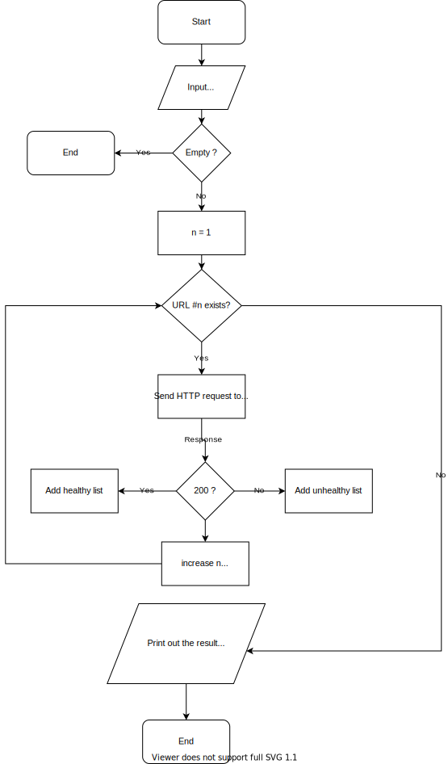

# Programming Fundamentals

This repository explains the programming fundamentals with some practical examples.

Following is the general outline and the flowchart of a program that runs health check for a given list of URLs. 

## Outline

## Flowchart

Flowchart [wiki](https://en.wikipedia.org/wiki/Flowchart).

[Iodraw](https://www.iodraw.com/diagram/) online flowchart application.